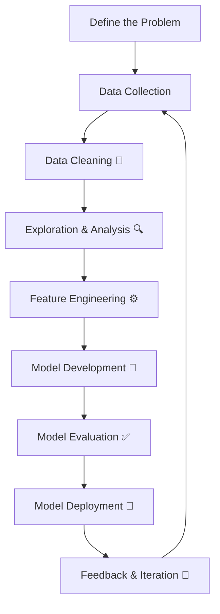

# 🚀 The Data Science Process  
*A step-by-step guide to turning raw data into meaningful solutions.*  
The data science process consists of a series of structured steps that systematically transform raw data into meaningful and actionable insights. 
Each stage plays a critical role in ensuring the accuracy, relevance, and effectiveness of the final outcome. The following sections provide a detailed explanation of these steps.

---

## 📑 Table of Contents  
1. [Define the Problem](#1️⃣-define-the-problem)  
2. [Data Collection](#2️⃣-data-collection)  
3. [Data Cleaning](#3️⃣-data-cleaning)  
4. [Data Exploration & Analysis](#4️⃣-data-exploration--analysis)  
5. [Feature Engineering](#5️⃣-feature-engineering)  
6. [Model Development](#6️⃣-model-development)  
7. [Model Evaluation](#7️⃣-model-evaluation)  
8. [Model Deployment](#8️⃣-model-deployment)  
9. [Feedback & Iteration](#9️⃣-feedback--iteration)  

---

## 1️⃣ Define the Problem  

Every data science project begins with a **clear definition of the problem**. At this stage, the focus is on understanding the **core objective**, aligning with stakeholders, and framing the precise question to be answered. Without a well-defined problem, even the most advanced analysis can miss the mark.  

A strong problem statement ensures measurable goals, provides criteria for evaluating success, and keeps all later steps—data collection, cleaning, analysis, and modeling—focused and relevant.  

### 🔹 Steps Involved  
- **Understand the Business Context** → Engage with stakeholders to clarify goals, constraints, and expected outcomes.  
- **Define Objectives** → Translate broad goals into specific, measurable, and actionable objectives.  
- **Establish Success Metrics** → Decide how performance will be measured, such as accuracy, efficiency, or ROI.  
- **Identify the Problem Type** → Determine whether the task involves classification, regression, clustering, or another analytical approach.  

💡 **Example:**  
A retail company wants to reduce churn. The problem can be framed as:  
*"Which customers are most likely to stop purchasing, and what factors drive their decision?"*  

---

## 2️⃣ Data Collection  

Once the problem is defined, the next step is **gathering relevant data**. Data quality and relevance directly impact the success of the project.  

### 🔹 Steps Involved  
- **Identify Sources** → Databases, APIs, sensors, logs, surveys, or web scraping.  
- **Use Collection Tools** → SQL, Python, ETL pipelines, or scraping frameworks.  
- **Ensure Relevance** → Only collect data that supports the defined objectives.  

💡 **Example:**  
For churn prediction, useful data may include:  
- Transaction history  
- Customer support records  
- Demographic information  

---

## 3️⃣ Data Cleaning 🧹  

Raw data is rarely ready for analysis—it often contains missing values, duplicates, and inconsistencies. **Cleaning ensures accuracy and consistency.**  

### 🔹 Steps Involved  
- Handle missing values (imputation, deletion, or algorithm-based approaches).  
- Remove duplicates that skew analysis.  
- Standardize formats and correct inconsistencies (e.g., *"NY"* vs *"New York"*).  
- Detect and handle outliers.  

💡 **Example:**  
If customer age values are missing, you might fill them with the **median age** or predict missing values using related features.  

---

## 4️⃣ Data Exploration & Analysis (EDA) 🔍  

Exploratory Data Analysis helps uncover **patterns, anomalies, and relationships** in data.  

### 🔹 Steps Involved  
- **Visualize Data** → Histograms, scatter plots, box plots.  
- **Compute Summaries** → Mean, median, correlations, standard deviation.  
- **Identify Patterns** → Spot trends, anomalies, and feature relationships.  

💡 **Example:**  
Analyzing churn may reveal:  
- 📉 Customers with fewer years of service and lower satisfaction scores are more likely to leave.  

---

## 5️⃣ Feature Engineering ⚙️  

Feature engineering transforms raw data into meaningful inputs that improve model performance.  

### 🔹 Steps Involved  
- Select the most relevant features.  
- Transform features (scaling, normalization, log transformations).  
- Create new features using domain knowledge.  
- Encode categorical variables for machine learning models.  

💡 **Example:**  
In house price prediction:  
- Raw features → `bedrooms`, `square_footage`, `location`  
- Engineered feature → `price_per_sqft`  

---

## 6️⃣ Model Development 🤖  

This step involves **choosing and training machine learning models**.  

### 🔹 Steps Involved  
- **Select Model Type** → Classification, regression, clustering, etc.  
- **Train the Model** using training data.  
- **Tune Hyperparameters** (e.g., learning rate, tree depth).  
- **Validate with Cross-Validation** to prevent overfitting.  

💡 **Example:**  
For churn prediction, a **Random Forest** classifier may be selected and tuned using grid search for optimal accuracy.  

---

## 7️⃣ Model Evaluation ✅  

Models must be evaluated against predefined success metrics.  

### 🔹 Steps Involved  
- Use metrics:  
  - Classification → Accuracy, Precision, Recall, F1, ROC-AUC  
  - Regression → MSE, RMSE, R²  
- Analyze confusion matrices.  
- Compare multiple models to choose the best-performing one.  
- Check for overfitting/underfitting.  

💡 **Example:**  
If predicting churn, focus on **Precision/Recall** if the goal is to minimize false positives and false negatives.  

---

## 8️⃣ Model Deployment 🚀  

Deployment integrates the trained model into a real-world environment where it provides predictions or insights.  

### 🔹 Steps Involved  
- Deploy via APIs, web apps, or cloud platforms (AWS, GCP, Azure).  
- Automate pipelines for continuous data input.  
- Monitor performance in real-time.  
- Scale infrastructure as data volume grows.  

💡 **Example:**  
A fraud detection model deployed in a banking system to flag suspicious transactions in **real-time**.  

---

## 9️⃣ Feedback & Iteration 🔄  

Deployment is not the end—models need continuous improvement.  

### 🔹 Steps Involved  
- Collect stakeholder/user feedback.  
- Monitor **data drift** over time.  
- Retrain models with new data.  
- Iterate through the process as business needs evolve.  

💡 **Example:**  
An e-commerce recommendation engine may need retraining if customer preferences shift, ensuring recommendations remain relevant.  

---

## 📊 Data Science Process Flowchart  

