# 🚀 The Data Science Process  
*A step-by-step guide to turning raw data into meaningful solutions.*  
The data science process consists of a series of structured steps that systematically transform raw data into meaningful and actionable insights. 
Each stage plays a critical role in ensuring the accuracy, relevance, and effectiveness of the final outcome. The following sections provide a detailed explanation of these steps.

---

## 📑 Table of Contents  
1. [Define the Problem](#1️⃣-define-the-problem)  
2. [Data Collection](#2️⃣-data-collection)  
3. [Data Cleaning](#3️⃣-data-cleaning)  
4. [Data Exploration & Analysis](#4️⃣-data-exploration--analysis)  
5. [Feature Engineering](#5️⃣-feature-engineering)  
6. [Model Development](#6️⃣-model-development)  
7. [Model Evaluation](#7️⃣-model-evaluation)  
8. [Model Deployment](#8️⃣-model-deployment)  
9. [Feedback & Iteration](#9️⃣-feedback--iteration)  

---

## 1️⃣ Define the Problem  

Every data science project begins with a **clear definition of the problem**. At this stage, the focus is on understanding the **core objective**, aligning with stakeholders, and framing the precise question to be answered. Without a well-defined problem, even the most advanced analysis can miss the mark.  

A strong problem statement ensures measurable goals, provides criteria for evaluating success, and keeps all later steps—data collection, cleaning, analysis, and modeling—focused and relevant.  

### 🔹 Steps Involved  
- **Understand the Business Context** → Engage with stakeholders to clarify goals, constraints, and expected outcomes.  
- **Define Objectives** → Translate broad goals into specific, measurable, and actionable objectives.  
- **Establish Success Metrics** → Decide how performance will be measured, such as accuracy, efficiency, or ROI.  
- **Identify the Problem Type** → Determine whether the task involves classification, regression, clustering, or another analytical approach.  

💡 **Example:**  
A retail company wants to reduce churn. The problem can be framed as:  
*"Which customers are most likely to stop purchasing, and what factors drive their decision?"*  

---

## 2️⃣ Data Collection  

The second step in the data science process is data collection, which focuses on **gathering the right data** from multiple sources to address the defined problem. Since data forms the backbone of any data science project, ensuring accuracy, quality, and completeness is critical to deriving meaningful insights.  

### 🔹 Steps Involved  
- **Identify Sources** → Determine potential sources such as internal databases, APIs, sensors, logs, surveys, or web scraping.  
- **Use Collection Tools** → Employ technologies like SQL, Python, web scraping frameworks, or ETL (Extract, Transform, Load) pipelines to efficiently collect data. 
- **Ensure Relevance** → Confirm that the gathered data directly supports the problem you are trying to solve, avoiding unnecessary or misleading information.  

---

## 3️⃣ Data Cleaning 🧹  

Data cleaning is a vital step in the data science process that **ensures the dataset is accurate, consistent, and reliable**. Since raw data often contains problems such as missing values, duplicates, inconsistencies, or outliers, cleaning the data is essential for producing valid analyses and building robust models. Poorly cleaned data can lead to misleading results and reduce model performance. 

### 🔹 Steps Involved  
- **Handle missing values** (imputation, deletion, or algorithm-based approaches) Identify missing values and apply appropriate techniques such as imputation, deletion, or leveraging algorithms designed to handle incomplete data  .  
- **Remove duplicates that skew analysis:** Detect and eliminate duplicate records to prevent bias or overrepresentation in the dataset.  
- Standardize formats and correct inconsistencies (e.g., *"J&K"* vs *"Jammu and Kashmir"*).  
- **Detect and handle outlier:** Identify unusual values and decide whether to retain, adjust, or remove them, depending on their impact on the analysis.

## 4️⃣ Data Exploration & Analysis (EDA) 🔍 

Exploratory Data Analysis helps uncover **patterns, anomalies, and relationships** in data.  

### 🔹 Steps Involved  
- **Visualize Data** → Use techniques such as histograms, scatter plots, bar charts, and box plots to examine distributions, spot relationships, and detect unusual values.   
- **Compute Summaries** → Mean, median, correlations, standard deviation.  
- **Identify Patterns** →Detect recurring patterns, trends, outliers, or anomalies that may influence results or require further preprocessing.
- **Analyze Feature Relationships:** Study interactions among features using correlation heatmaps, pair plots, or cross-tabulations, which can guide feature selection and engineering.  

---

## 5️⃣ Feature Engineering ⚙️  

Feature engineering transforms raw data into meaningful inputs that improve model performance.  

### 🔹 Steps Involved  
- Select the most relevant features.  
- Transform features (scaling, normalization, log transformations).  
- Create new features using domain knowledge.  
- Encode categorical variables for machine learning models.  

 

---

## 6️⃣ Model Development 🤖  

Once the data is cleaned and features are engineered, the next step in the data science process is model development. This stage focuses on selecting, training, and fine-tuning machine learning or statistical models to achieve the best possible performance for the defined problem.  

### 🔹 Steps Involved  
- **Model Selection:**  Choose an appropriate model based on the problem type (e.g., classification, regression, clustering) and the characteristics of the data. Popular choices include Linear Regression, Decision Trees, Random Forests, Support Vector Machines, Gradient Boosting methods, and Neural Networks.  

- **Model Training:**  Train the selected model on the training dataset, enabling it to learn patterns and relationships in the data by adjusting its internal parameters.  

- **Hyperparameter Tuning:** Optimize model performance by fine-tuning hyperparameters (e.g., learning rate, maximum tree depth, number of estimators). Techniques such as Grid Search, Random Search, or Bayesian Optimization can be used for this process.  

- **Cross-Validation:** Apply methods like k-fold cross-validation to evaluate model performance on different subsets of data. This helps ensure the model generalizes well and minimizes overfitting.   

 

---

## 7️⃣ Model Evaluation ✅  

Once a model is developed, the next critical step is evaluating its performance. This phase ensures that the model not only produces accurate predictions but also aligns with the objectives defined during the problem formulation stage. Proper evaluation helps identify strengths, weaknesses, and areas for improvement before deploying the model into real-world use.  

### 🔹 Steps Involved  
- **Performance Metrics:**  
  Select and compute suitable evaluation metrics depending on the task.  
  - For classification models: **accuracy, precision, recall, F1-score, ROC-AUC**.  
  - For regression models: **Mean Squared Error (MSE), Root Mean Squared Error (RMSE), R-squared**.  

- **Confusion Matrix Analysis:**  
  For classification tasks, study the confusion matrix to understand the distribution of predictions across classes (true positives, true negatives, false positives, and false negatives). This provides deeper insight beyond a single accuracy score.  

- **Model Comparison:**  
  Compare multiple models or algorithms on the same dataset to determine which one performs best. This may involve testing both simple models (e.g., Logistic Regression) and complex ones (e.g., Random Forest, Neural Networks).  

- **Addressing Overfitting and Underfitting:**  
  Ensure the model strikes a balance between bias and variance.  
  - **Overfitting** occurs when the model learns noise instead of patterns.  
  - **Underfitting** results from overly simplistic assumptions.  
  Techniques such as **cross-validation, regularization, and pruning** can help mitigate these issues.    

---

## 8️⃣ Model Deployment 🚀  

Deployment integrates the trained model into a real-world environment where it provides predictions or insights.  

### 🔹 Steps Involved  
- Deploy via APIs, web apps, or cloud platforms (AWS, GCP, Azure).  
- Automate pipelines for continuous data input.  
- Monitor performance in real-time.  
- Scale infrastructure as data volume grows.  

 ---

## 📊 Data Science Process Flowchart  

```mermaid

flowchart TD
    A[Define the Problem] --> B[Data Collection]
    B --> C[Data Cleaning 🧹]
    C --> D[Exploration & Analysis 🔍]
    D --> E[Feature Engineering ⚙️]
    E --> F[Model Development 🤖]
    F --> G[Model Evaluation ✅]
    G --> H[Model Deployment 🚀]
    H --> I[Feedback & Iteration 🔄]
    I --> B
```

