# 🚀 The Data Science Process: Key Steps to Build Data-Driven Solutions  

> *A practical guide to understanding how raw data becomes real-world impact.*  

---

## 📑 Table of Contents  
- [Overview](#-overview)  
- [Key Steps in the Data Science Process](#-key-steps-in-the-data-science-process)  
  1. [Define the Problem](#1-define-the-problem)  
  2. [Data Collection](#2-data-collection)  
  3. [Data Cleaning](#3-data-cleaning)  
  4. [Data Exploration & Analysis](#4-data-exploration--analysis)  
  5. [Feature Engineering](#5-feature-engineering)  
  6. [Model Development](#6-model-development)  
  7. [Model Evaluation](#7-model-evaluation)  
  8. [Model Deployment](#8-model-deployment)  
  9. [Feedback & Iteration](#9-feedback--iteration)  
- [Key Components](#-key-components-of-the-data-science-process)  
- [Tools](#-tools-for-the-data-science-process)  
- [Usage](#-usage-of-the-data-science-process)  
- [Challenges](#-challenges-in-the-data-science-process)  
- [Level Up 🚀](#-transform-your-data-science-career)  

---
## 📊 Data Science Process Flowchart  

```mermaid
flowchart TD
    A[Define the Problem] --> B[Data Collection]
    B --> C[Data Cleaning 🧹]
    C --> D[Exploration & Analysis 🔍]
    D --> E[Feature Engineering ⚙️]
    E --> F[Model Development 🤖]
    F --> G[Model Evaluation ✅]
    G --> H[Model Deployment 🚀]
    H --> I[Feedback & Iteration 🔄]
    I --> B
```

## 🌟 Overview  

The **data science process** is a systematic approach to solving problems using data.  
It helps data scientists:  

✔️ Collect data  
✔️ Clean & analyze it  
✔️ Build models  
✔️ Derive actionable insights  

In today’s **data-driven world**, this process helps businesses:  
- 📊 Make informed decisions  
- 🔮 Predict trends  
- ⚡ Optimize operations  

> 💡 Fun fact: What started as *computer science* has evolved into *data science*, and computer centers have transformed into **data centers**.  

---

## 🔑 Key Steps in the Data Science Process  

### 1. Define the Problem  

Understanding the **business or research objective** is the first step.  
You must collaborate with stakeholders, define objectives, and identify measurable success metrics.  

**Steps Involved:**  
- Understand the business context  
- Define specific objectives  
- Establish success metrics (accuracy, ROI, efficiency)  
- Identify the problem type (classification, regression, clustering, etc.)  

👉 **Example:**  
A bank wants to **reduce customer churn**.  
The problem statement:  
*"How can we predict which customers are likely to leave, and what factors influence their decision?"*  

---

### 2. Data Collection  

Data is the foundation of every project. Without **relevant and high-quality data**, insights will be weak.  

**Steps Involved:**  
- Identify data sources (databases, APIs, web scraping, surveys)  
- Use acquisition tools (SQL, Python, ETL pipelines)  
- Ensure data relevance to the problem  

👉 **Example:**  
For customer churn prediction, sources might include:  
- 🧾 Transaction history  
- 📞 Customer support records  
- 👤 Demographic data  

---

### 3. Data Cleaning 🧹  

Raw data is messy! It may contain missing values, duplicates, or inconsistencies.  
Cleaning ensures your analysis isn’t biased or flawed.  

**Steps Involved:**  
- Handle missing data (imputation, deletion, algorithms)  
- Remove duplicates  
- Correct inconsistencies (e.g., "NY" vs. "New York")  
- Detect and treat outliers  

👉 **Example:**  
If customer ages are missing, you might replace them with the **median age** or predict them using other features.  

---

### 4. Data Exploration & Analysis (EDA) 🔍 

Exploratory Data Analysis helps discover **patterns, anomalies, and relationships** in data.  

**Steps Involved:**  
- Visualize data (histograms, scatter plots, box plots)  
- Compute statistical summaries (mean, median, correlations)  
- Identify trends and anomalies  
- Study feature relationships  

👉 **Example:**  
When analyzing churn, you may find:  
- 📉 Older customers with fewer years of service churn more often  

---

### 5. Feature Engineering ⚙️  

This is where you **transform raw data into smarter features** for models.  

**Steps Involved:**  
- Select relevant features  
- Transform values (scaling, normalization)  
- Create new features (ratios, indices)  
- Encode categorical variables  

👉 **Example:**  
For house price prediction:  
- Raw features → `bedrooms`, `sq_ft`, `neighborhood`  
- New feature → `price_per_sq_ft`  

---

### 6. Model Development 🤖  

Now the fun part—**building machine learning models!**  

**Steps Involved:**  
- Select model type (regression, classification, clustering)  
- Train the model  
- Tune hyperparameters (grid/random search)  
- Validate with cross-validation  

👉 **Example:**  
Predicting churn: Use a **Random Forest** model, adjust tree depth, and validate with k-fold cross-validation.  

---

### 7. Model Evaluation ✅  

Measure how well the model performs.  

**Steps Involved:**  
- Use metrics:  
  - Classification → Accuracy, Precision, Recall, F1, ROC-AUC  
  - Regression → MSE, R²  
- Confusion Matrix analysis  
- Compare models to choose the best one  
- Avoid overfitting/underfitting  

👉 **Example:**  
If precision is critical (e.g., predicting **actual churners**), focus more on **Precision/Recall** than overall accuracy.  

---

### 8. Model Deployment 🚀  

A model is only valuable if it’s put into action.  

**Steps Involved:**  
- Integrate with apps/APIs (Flask, Django, AWS, Azure)  
- Automate predictions with pipelines  
- Monitor performance in real-time  
- Scale for larger data volumes  

👉 **Example:**  
A fraud detection model deployed in **real-time banking transactions** to flag suspicious activities.  

---

### 9. Feedback & Iteration 🔄  

Models must evolve with **new data and feedback**.  

**Steps Involved:**  
- Collect stakeholder/user feedback  
- Monitor data drift  
- Retrain and fine-tune models  
- Repeat the cycle as needed  

👉 **Example:**  
If an **e-commerce recommendation system** starts losing accuracy, retrain it with **updated customer preferences**.  

---

## 🧩 Key Components of the Data Science Process  
- Data  
- Algorithms  
- Tools & Infrastructure  
- Business Context  
- Feedback Loop  

---

## 🛠 Tools for the Data Science Process  

| Step              | Tools & Tech Used |
|-------------------|-------------------|
| Data Collection   | SQL, Python, APIs, Web Scraping, ETL |
| Data Cleaning     | Pandas, NumPy, OpenRefine |
| EDA               | Matplotlib, Seaborn, Plotly |
| Feature Engineering | Scikit-learn, FeatureTools |
| Model Development | Scikit-learn, TensorFlow, PyTorch |
| Deployment        | Flask, FastAPI, AWS, GCP, Azure |
| Monitoring        | MLflow, Evidently AI |

---

## 🌍 Usage of the Data Science Process  
- 📈 Business decision-making  
- 🏥 Healthcare diagnostics  
- 🛒 Recommendation systems  
- 🏦 Fraud detection  
- 🚗 Self-driving cars  

---

## ⚠️ Challenges in the Data Science Process  
- Poor data quality  
- Unclear business objectives  
- Overfitting/underfitting  
- Deployment hurdles  
- Data privacy & ethics 
